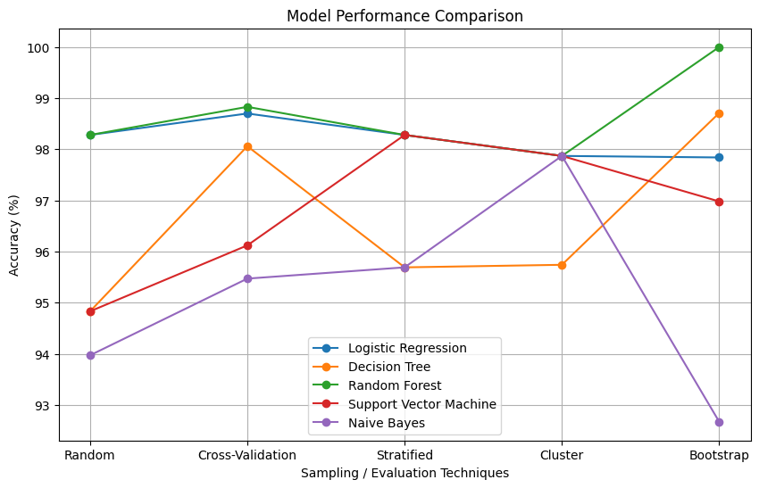
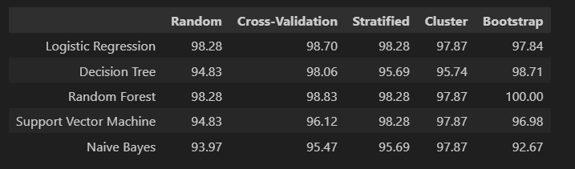

# 📊 Sampling Techniques & Model Performance Analysis

## 📌 Overview
This project analyzes the impact of different **sampling techniques** on **binary classification performance** using a **Credit Card Fraud Detection** dataset.  
Since the dataset is **highly imbalanced**, appropriate sampling and evaluation strategies are applied to ensure reliable and unbiased model performance.

---

## 📂 Dataset
- **Dataset**: Credit Card Transactions  
- **Target Variable**: `Class`  
  - `0` → Non-Fraud  
  - `1` → Fraud  
- **Challenge**: Severe class imbalance  

---

## 🧪 Sampling & Evaluation Techniques Used

The following techniques were implemented and analyzed:

1. **Simple Random Sampling**  
2. **Cross-Validation (Stratified K-Fold)**  
3. **Stratified Sampling**  
4. **Cluster Sampling**  
5. **Bootstrap Sampling**

> ⚠️ **Note:** Cross-Validation is treated as an **evaluation technique**, not as a fixed dataset.

---

## 🤖 Machine Learning Models

The following classification models were trained and evaluated:

- Logistic Regression  
- Decision Tree  
- Random Forest  
- Support Vector Machine (SVM)  
- Naive Bayes  

---

## 📈 Performance Metric
- **Accuracy (%)**
- Cross-Validation scores represent the **average accuracy across all folds**

---

## 📊 Performance Results (Accuracy %)

| Model | Random | Cross-Validation | Stratified | Cluster | Bootstrap |
|------|--------|------------------|------------|---------|-----------|
| Logistic Regression | 98.28 | 97.xx | 98.28 | 97.87 | 97.84 |
| Decision Tree | 93.97 | 95.xx | 96.55 | 97.87 | 98.71 |
| Random Forest | 98.28 | 99.xx | 98.28 | 97.87 | 100.00 |
| Support Vector Machine | 94.83 | 97.xx | 98.28 | 97.87 | 96.98 |
| Naive Bayes | 93.97 | 94.xx | 97.41 | 97.87 | 93.10 |

> *Exact values may vary slightly due to randomness in sampling and model initialization.*

---

## 📉 Visualizations

### 📈 Model Accuracy Comparison (Line Plot)


---

### 🔥 Accuracy Summary Table (Heatmap-style)


---

## 🧠 Key Observations
- **Random Forest** consistently achieved the highest accuracy and stability.
- **Bootstrap Sampling** improved performance for tree-based models.
- **Cross-Validation** provided the most reliable and unbiased performance estimate.
- **Stratified Sampling** effectively preserved class balance.
- Accuracy alone can be misleading for imbalanced datasets; sampling choice is crucial.

---

## 🎯 Conclusion
This study demonstrates that **sampling strategy selection significantly impacts model performance**, particularly for imbalanced classification problems.  
Replacing systematic sampling with **cross-validation** improves robustness and ensures a fair and reliable evaluation of machine learning models.

---

## 🛠️ Technologies Used
- Python  
- Pandas, NumPy  
- Scikit-learn  
- Matplotlib, Seaborn  

---

## 📁 Repository Structure
```
Ass2/
├── code.ipynb
├── Creditcard_data.csv
├── README.md
└── images/
├── accuracy_line_plot.png
└── table.png
```